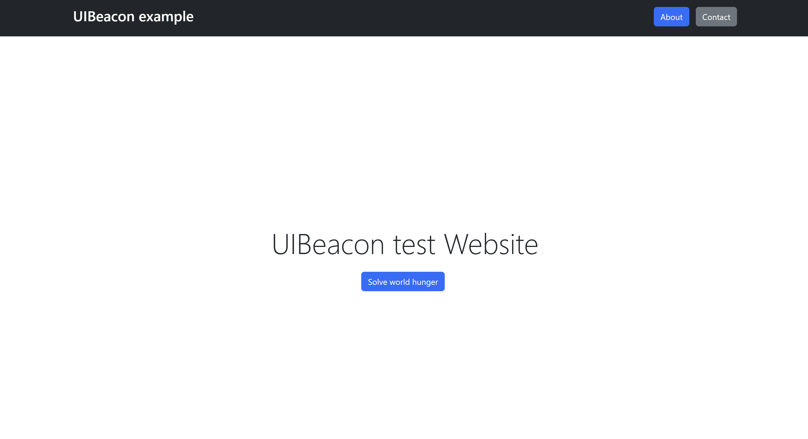

# UIBeaconLang

## Introduction

UIBeaconLang is a **structured natural language** designed to help developers describe their user interfaces in a way that large language models (LLMs) can understand. It can be used to build chatbots or agents that guide users through apps and websites, making it particularly useful for complex sites where users might feel overwhelmed.

UIBeaconLang is XML-based, allowing front-end developers to use a familiar format. However, it enforces additional rules and removes unnecessary boilerplate.

**Note:** UIBeaconLang is *not* a programming language! When writing in UIBeaconLang, you are essentially crafting a prompt.

#### Why Not Use a Standard Prompt?

Describing a complex UI without enforcing a schema leads to inconsistencies, confusing both developers and LLMs. UIBeaconLang has been extensively tested and optimized to ensure simplicity and better understanding by LLMs.

#### Why Not Use the Website's HTML?

In theory, you could expose your HTML directly to an LLM, but this tends to perform worse—especially in scenarios where you have a single-page application with complex JavaScript or CSS. If you need to add additional context about how your app functions beyond what is visible in the source code, raw HTML quickly becomes insufficient.

#### Why Not Use Screenshots?

Using screenshots (possibly combined with tools like Microsoft OmniParser) can be more effective than relying solely on source code. However, while LLMs and agents continue to improve, UIBeaconLang currently achieves better results because it can also provide additional context about the functionality of your app or website—something screenshots alone cannot do.

---

## Getting Started

To give you an initial idea of UIBeaconLang, we will describe the following minimalistic website using it:



Here is a sample UIBeaconLang description of that website:

```xml
<App name="UIBeacon example">
    <Header position="top of the screen">
        <Nav position="far left"  label="UIBeacon example" to="WelcomePage" />
        <Nav position="far right" label="About" to="AboutPage" />
        <Nav position="far right" label="Contact" to="ContactPage" />
    </Header>

    <Page name="WelcomePage">
        <Text value="UIBeacon test Website" position="centered"/>
        <Button label="Solve world hunger" description="Uses quantum computing to find a solution for world hunger."/>
    </Page>
    
    <IncludePage href="pages/contact_page.uibl" />
    <IncludePage href="pages/about_page.uibl" />
</App>
```

After writing this UIBeaconLang code, you can use UIBeacon to load the predefined prompts and include a chatbot on the page, allowing users to ask questions such as:

```json
// input 1
{
    "current_page": "WelcomePage",
    "users_question": "What can I do on this website that uses Quantum computing?"
}
{
    "gpt4o_response": "Below the centered text on the current page, click on the button labeled \"Solve world hunger\". The Website uses Quantum Computing to find a solution for world hunger."
}

// input 2
{
    "current_page": "WelcomePage",
    "users_question": "How can I get to the about page?"
}
{
    "gpt4o_response": "At the far right of the top of the screen, click on the \"About\" button."
}
```

The quality of responses scales remarkably well with website complexity, as outlined in the [test results](https://github.com/DavidTokar12/ui_beacon).

## Documentation

Create a file called `<your_website_name>_app.uibl` (the `_app.uibl` extension is required). This file will serve as your main entry point: 

```xml
<App
    name=""            // Required: Name of your app
    description=""     // Optional: Helps the LLM understand the structure or functionality of the app.
>
</App>
```

Within the `App` component, you can define four types of sub-components: `Header`, `SideBar`, `Page`, and `Footer`.

- You can omit any of these components, but their order must be maintained. For example, no Page can appear after a Footer.
- You can include multiple Page components, but only one Header, one SideBar, and one Footer are allowed.


```xml
<Header | SideBar | Footer
    position=""        // Optional: e.g.: "top of the screen"
    description=""     // Optional: Helps the LLM understand the structure or functionality of the header, sidebar, or footer.
    visibleWhen=""     // Optional: For initially hidden components, describe how to make them appear.
>
    // any number of child components
</Header>

<Page
    name=""            // Required: A unique name for your page. Must end with `Page`! The LLM will use this name when referring to this page.
    description=""     // Optional: Helps the LLM understand the structure or functionality of the page.
>
    // any number of child components
</Page>
```
#### Including Pages

You can also define pages in different files named `<your_page_name>_page.uibl` (the `_page.uibl` extension is required), and include them like so:

```xml
// ui_beacon_app.uibl
<App name="...">
    ...
    <IncludePage href="pages/ui_beacon_page.uibl" />
    ...
</App>

// pages/ui_beacon_page.uibl
<Page name="...">
    ...
</Page>
```

**Note:** The UIBeaconLang parser will copy and paste the page content and replace it with it's corresponding `<IncludePage>` directive. You can try to keep the page order logical to help the LLM orient itself, but ignoring the order has not shown a major decrease in performance.

#### Child components

Any UI component other than `App`, `Header`, `SideBar`, `Footer`, or `Page` is a child component. Child components share similar attributes, so we group them together to keep the documentation concise.

There are three groups of child components:

#### Base Child Component Attributes:
| Attribute       | Description                                                                                             |
| --------------- | --------------------------------------------------------------------------------------------------------|
| **name**        | Optional: If you want to reference this component from another location.                                |
| **label**       | Optional: If the component has a label or text that helps the user locate it.                           |
| **icon**        | Optional: If the component has an icon that helps the user locate it.                                   |
| **style**       | Optional: Special styling that helps users identify it (e.g., “rounded yellow box”).                    |
| **description** | Optional: Information to help the LLM understand its structure or functionality.                        |
| **position**    | Optional: Describes where it appears on the screen (e.g., “Next to the big sign-up button”).            |
| **visibleWhen** | Optional: Action required to make the component visible (e.g., “User hovers over the list item”).       |


#### Interactive Component Attributes:
| Attribute  | Description                                                                      |
| ---------- | ---------------------------------------------------------------------------------|
|            | Inherits all attributes from Base Child Component Attributes.                    |
| **action** | Optional: Describes what happens when the user interacts with the component.     |

#### Media Component Attributes:

This group inherits everything from **Base Child Component Attributes** except it does not have an icon attribute.

Although many attributes are optional, **skipping them** can lead to poorer results because the LLM has less contextual information. The goal is to give you the maximum flexibility to choose the attributes that effectively describe the UI, while minimizing your effort.

### List of child components

| Component        | Type        | Additional Attributes                            | Allowed Child Components    |
| ---------------- | ----------- | -------------------------------------------------|---------------------------- |
| **Text**         | Base        | value (the text content)                         | -                           |
| **Section**      | Base        | -                                                | any number of any component |
| **Wrapper**      | Base        | orientation (optional; can be “horizontal”)      | any number of any component |
| **List**         | Base        | orientation (optional; can be “horizontal”)      | 0 or 1 `ListItem`           |
| **Nav**          | Base        | -                                                | -                           |
| **Link**         | Base        | -                                                | -                           |
| **Button**       | Interactive | -                                                | -                           |
| **DropDown**     | Interactive | -                                                | any number of `Option`      |
| **RadioGroup**   | Interactive | -                                                | any number of `Option`      |
| **TextInput**    | Interactive | placeholder                                      | -                           |
| **Form**         | Interactive | -                                                | any number of any component |
| **DateSelector** | Interactive | -                                                | -                           |
| **CheckBox**     | Interactive | -                                                | -                           |
| **Option**       | Interactive | value                                            | -                           |
| **Nav**          | Interactive | to (the precise name of the page it navigates to)| -                           |
| **Image**        | Media       |                                                  | -                           |
| **Video**        | Media       |                                                  | -                           |


### Nav vs. Link

### Section vs. Wrapper

### Lists


## Guide

Bad practice:
```xml 
<Option value="Delete this message" action="Deletes this email" />
```